# BTCUSD Analyzer - Projektziele (Mermaid Charts)

## 1. Gesamtuebersicht: Die drei Hauptziele

```mermaid
flowchart TB
    subgraph Vision["VISION: Automatisiertes Trading"]
        direction TB
        V1["Desktop-Anwendung fuer BTC-Trading"]
    end

    subgraph Goals["DREI HAUPTZIELE"]
        direction TB

        subgraph G1["Hauptziel 1: BACKTESTER"]
            G1A["A) Einzeltest<br/>Manueller Workflow"]
            G1B["B) Walk-Forward<br/>Automatische Evaluation"]
        end

        subgraph G2["Hauptziel 2: SESSION-MANAGEMENT"]
            G2A["Speichern nach<br/>jedem Schritt"]
            G2B["Laden und<br/>Weiterarbeiten"]
        end

        subgraph G3["Hauptziel 3: VOLLAUTOMATIK"]
            G3A["Live Trading<br/>Binance API"]
            G3B["Simulierter Modus<br/>CSV-Puffer"]
        end
    end

    Vision --> Goals

    style G1 fill:#2d4a2d,stroke:#33b34d
    style G2 fill:#3d3d1a,stroke:#e6b333
    style G3 fill:#2d3d4a,stroke:#33a3b3
```

---

## 2. Hauptziel 1: Backtester

### A) Einzeltest-Workflow

```mermaid
flowchart TB
    subgraph Einzeltest["EINZELTEST WORKFLOW"]
        direction TB

        S1["1. DATEN LADEN<br/>Binance API / CSV<br/>Alle Kurse: BTCUSDT, ETHUSDT, etc."]
        S2["2. VERARBEITEN<br/>Features berechnen<br/>NaN entfernen<br/>Normalisieren"]
        S3["3. LERNZIELE<br/>Peaks erkennen<br/>Labels: BUY/SELL/HOLD<br/>Sequenzen erstellen"]
        S4["4. TRAINING<br/>BILSTM / GRU / Transformer<br/>Train/Val Split<br/>Callbacks"]
        S5["5. BACKTEST<br/>Out-of-Sample Daten<br/>Trades simulieren<br/>Metriken berechnen"]

        S1 --> S2 --> S3 --> S4 --> S5
    end

    subgraph GUI["GUI FENSTER"]
        W2["2 - PrepareData"]
        W3["3 - Training"]
        W4["4 - Backtest"]
    end

    S1 --> W2
    S2 --> W2
    S3 --> W2
    S4 --> W3
    S5 --> W4

    style S1 fill:#2d4a2d,stroke:#33b34d
    style S2 fill:#2d4a2d,stroke:#33b34d
    style S3 fill:#2d4a2d,stroke:#33b34d
    style S4 fill:#2d4a2d,stroke:#33b34d
    style S5 fill:#2d4a2d,stroke:#33b34d
```

### B) Walk-Forward-Workflow

```mermaid
flowchart LR
    subgraph Config["KONFIGURATION"]
        C1["Fenster-Typ:<br/>ANCHORED / ROLLING"]
        C2["Window Size<br/>Step Size"]
        C3["Purge/Embargo Gap"]
    end

    subgraph Folds["WALK-FORWARD FOLDS"]
        F1["Fold 1<br/>Train | OOS"]
        F2["Fold 2<br/>Train | OOS"]
        F3["Fold 3<br/>Train | OOS"]
        FN["Fold N<br/>Train | OOS"]

        F1 --> F2 --> F3 --> FN
    end

    subgraph PerFold["PRO FOLD"]
        P1["Daten vorbereiten"]
        P2["Modell trainieren"]
        P3["OOS Predictions"]
        P4["Metriken sammeln"]

        P1 --> P2 --> P3 --> P4
    end

    subgraph Results["ERGEBNIS"]
        R1["Kombinierte OOS<br/>Equity Curve"]
        R2["Stabilitaets-<br/>Metriken"]
        R3["Overfitting-<br/>Analyse"]
    end

    Config --> Folds
    Folds --> PerFold
    PerFold --> Results

    style Folds fill:#2d4a2d,stroke:#33b34d
    style Results fill:#3d3d1a,stroke:#e6b333
```

---

## 3. Hauptziel 2: Session-Management

### Speichern und Laden

```mermaid
flowchart TB
    subgraph Workflow["EINZELTEST MIT SPEICHERPUNKTEN"]
        direction TB

        S1["1. Daten laden"]
        SAVE1["[Speichern]<br/>raw_data.csv<br/>data_config.json"]

        S2["2. Features"]
        SAVE2["[Speichern]<br/>features.npz<br/>normalizer.pkl"]

        S3["3. Labels"]
        SAVE3["[Speichern]<br/>labels.npz<br/>sequences.npz"]

        S4["4. Training"]
        SAVE4["[Speichern]<br/>model.pt<br/>training_history.json"]

        S5["5. Backtest"]
        SAVE5["[Speichern]<br/>backtest_results.json<br/>trades.csv"]

        S1 --> SAVE1 --> S2 --> SAVE2 --> S3 --> SAVE3 --> S4 --> SAVE4 --> S5 --> SAVE5
    end

    subgraph Session["SESSION-ORDNER"]
        DIR["sessions/session-2026-01-18/"]
        FILES["session_config.json<br/>raw_data.csv<br/>features.npz<br/>labels.npz<br/>model.pt<br/>..."]
    end

    SAVE1 --> DIR
    SAVE2 --> DIR
    SAVE3 --> DIR
    SAVE4 --> DIR
    SAVE5 --> DIR
    DIR --> FILES

    style SAVE1 fill:#3d3d1a,stroke:#e6b333
    style SAVE2 fill:#3d3d1a,stroke:#e6b333
    style SAVE3 fill:#3d3d1a,stroke:#e6b333
    style SAVE4 fill:#3d3d1a,stroke:#e6b333
    style SAVE5 fill:#3d3d1a,stroke:#e6b333
```

### Wiederverwendung

```mermaid
flowchart LR
    subgraph SessionManager["SESSION-MANAGER (1.1)"]
        LIST["Liste aller Sessions"]
        META["Metadaten anzeigen<br/>Datum, Schritt, Metriken"]
        LOAD["Session laden"]
    end

    subgraph UseCases["ANWENDUNGSFAELLE"]
        UC1["Modell laden<br/>→ Neuer Backtest"]
        UC2["Features laden<br/>→ Anderes Modell"]
        UC3["Labels laden<br/>→ Andere Hyperparams"]
        UC4["Daten laden<br/>→ Andere Features"]
    end

    LIST --> META --> LOAD
    LOAD --> UC1
    LOAD --> UC2
    LOAD --> UC3
    LOAD --> UC4

    style SessionManager fill:#3d3d1a,stroke:#e6b333
    style UseCases fill:#2d4a2d,stroke:#33b34d
```

---

## 4. Hauptziel 3: Vollautomatik-Modus

### Dateneingang: Live vs Simuliert

```mermaid
flowchart TB
    subgraph LiveMode["LIVE-MODUS"]
        BINANCE["Binance API<br/>WebSocket / REST"]
        LIVE_DATA["1 OHLCV Candle<br/>pro Timeframe<br/>(1H / 1M)"]

        BINANCE --> LIVE_DATA
    end

    subgraph SimMode["SIMULIERTER MODUS"]
        CSV["CSV-Datei<br/>Historische Daten"]
        BUFFER["Puffer"]
        SIM_DATA["1 Zeile pro Tick<br/>(simuliert Live)"]

        CSV --> BUFFER --> SIM_DATA
    end

    subgraph Format["IDENTISCHES FORMAT"]
        FMT["DateTime<br/>Open, High, Low, Close<br/>Volume"]
    end

    LIVE_DATA --> Format
    SIM_DATA --> Format

    style LiveMode fill:#2d3d4a,stroke:#33a3b3
    style SimMode fill:#3d3d1a,stroke:#e6b333
    style Format fill:#2d4a2d,stroke:#33b34d
```

### Vollautomatik-Workflow

```mermaid
flowchart TB
    subgraph Input["CANDLE-EINGANG"]
        IN1["Live: Binance API"]
        IN2["Simuliert: CSV-Puffer"]
    end

    subgraph Cycle["VERARBEITUNGS-ZYKLUS<br/>(Pro neue Candle)"]
        direction LR
        C1["FEATURE<br/>berechnen"]
        C2["PREDICT<br/>Signal"]
        C3["TRADE<br/>ausfuehren"]

        C1 --> C2 --> C3
    end

    subgraph Retrain["ROLLIERENDES RETRAINING<br/>(Nach X Candles)"]
        R1["Trigger:<br/>Zeit oder Performance-Drop"]
        R2["Neue Labels<br/>aus echten Ergebnissen"]
        R3["Modell<br/>nachtrainieren"]

        R1 --> R2 --> R3
    end

    subgraph Execution["ORDER EXECUTION"]
        E1["Live:<br/>Binance API Orders"]
        E2["Simuliert:<br/>Paper Trading"]
        E3["Risk Management:<br/>Position Size<br/>Stop-Loss<br/>Max Drawdown"]
    end

    Input --> Cycle
    Cycle --> Retrain
    Retrain -.->|"Neues Modell"| Cycle
    Cycle --> Execution

    style Cycle fill:#2d4a2d,stroke:#33b34d
    style Retrain fill:#3d3d1a,stroke:#e6b333
    style Execution fill:#2d3d4a,stroke:#33a3b3
```

---

## 5. GUI-Fenster Zuordnung

```mermaid
flowchart TB
    subgraph Main["1 - MAIN WINDOW"]
        M1["Zentrale Steuerung"]
    end

    subgraph Goal1["HAUPTZIEL 1: BACKTESTER"]
        W2["2 - PrepareData<br/>Schritte 1-3"]
        W3["3 - Training<br/>Schritt 4"]
        W4["4 - Backtest<br/>Schritt 5"]
        W42["4.2 - Walk-Forward<br/>Kompletter Run"]
    end

    subgraph Goal2["HAUPTZIEL 2: SESSION-MGMT"]
        W11["1.1 - SessionManager<br/>Speichern/Laden"]
    end

    subgraph Goal3["HAUPTZIEL 3: VOLLAUTOMATIK"]
        W6["6 - Trading<br/>Live + Simuliert"]
    end

    Main --> Goal1
    Main --> Goal2
    Main --> Goal3

    style Goal1 fill:#2d4a2d,stroke:#33b34d
    style Goal2 fill:#3d3d1a,stroke:#e6b333
    style Goal3 fill:#2d3d4a,stroke:#33a3b3
```

---

## 6. Implementierungs-Status

```mermaid
flowchart LR
    subgraph Done["FERTIG"]
        D1["Daten laden"]
        D2["Features berechnen"]
        D3["Labels generieren"]
        D4["Modell trainieren"]
        D5["Backtest"]
        D6["Walk-Forward"]
        D7["Session-Manager GUI"]
    end

    subgraph InProgress["IN ARBEIT"]
        P1["Live Predictions"]
        P2["Binance Order API"]
        P3["Risk Management"]
    end

    subgraph Planned["GEPLANT"]
        G1["FeatureProcessingPipeline"]
        G2["DataStreamValidator"]
        G3["SaveManager"]
        G4["Simulierter Live-Modus"]
        G5["Rollierendes Retraining"]
    end

    style Done fill:#2d4a2d,stroke:#33b34d
    style InProgress fill:#3d3d1a,stroke:#e6b333
    style Planned fill:#4a3333,stroke:#cc4d33
```

---

## 7. Roadmap

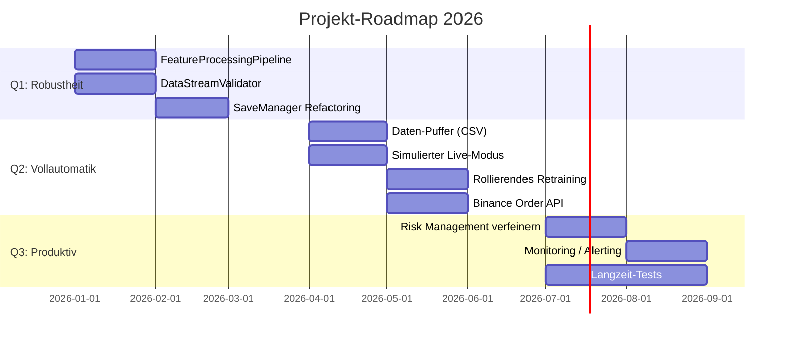

---

## 8. Architektur-Module

```mermaid
flowchart TB
    subgraph Infra["INFRASTRUKTUR-MODULE"]
        FPP["FeatureProcessingPipeline<br/>Zentrale Feature-Verarbeitung"]
        DSV["DataStreamValidator<br/>Konsistenz-Pruefung"]
        SM["SaveManager<br/>Atomare Speicherung"]
    end

    subgraph Goals["ALLE DREI HAUPTZIELE"]
        G1["Backtester"]
        G2["Session-Mgmt"]
        G3["Vollautomatik"]
    end

    FPP --> G1
    FPP --> G2
    FPP --> G3

    DSV --> G1
    DSV --> G3

    SM --> G2

    style Infra fill:#2d4a2d,stroke:#33b34d
```

---

## 9. Datenfluss Komplett

```mermaid
flowchart TB
    subgraph External["EXTERNE DATEN"]
        BIN["Binance API<br/>Live / Historisch"]
        CSV["CSV-Dateien"]
    end

    subgraph Goal1["BACKTESTER"]
        PREP["PrepareData<br/>Features + Labels"]
        TRAIN["Training<br/>BILSTM"]
        BT["Backtest"]
        WF["Walk-Forward"]
    end

    subgraph Goal2["SESSION-MGMT"]
        SAVE["Speichern"]
        LOAD["Laden"]
        SESSION["Session-Ordner"]
    end

    subgraph Goal3["VOLLAUTOMATIK"]
        LIVE["Live Trading"]
        SIM["Simuliert"]
        RETRAIN["Retraining"]
    end

    subgraph Output["ERGEBNISSE"]
        MODEL["Trainiertes Modell"]
        METRICS["Performance-Metriken"]
        TRADES["Trades / Profit"]
    end

    External --> Goal1
    Goal1 --> MODEL
    Goal1 --> METRICS

    Goal1 <--> Goal2
    SESSION --> SAVE
    SESSION --> LOAD

    MODEL --> Goal3
    External --> Goal3
    Goal3 --> TRADES
    Goal3 --> RETRAIN
    RETRAIN --> MODEL

    style Goal1 fill:#2d4a2d,stroke:#33b34d
    style Goal2 fill:#3d3d1a,stroke:#e6b333
    style Goal3 fill:#2d3d4a,stroke:#33a3b3
```

---

## Zusammenfassung

| Hauptziel | Zweck | GUI | Status |
|-----------|-------|-----|--------|
| **1. Backtester** | Modell entwickeln + evaluieren | 2, 3, 4, 4.2 | Fertig |
| **2. Session-Mgmt** | Zwischenstaende speichern/laden | 1.1 | Teilweise |
| **3. Vollautomatik** | Live Trading + Simulation | 6 | In Arbeit |
