# Feature Pipeline - Flowcharts

## 1. FeatureProcessingPipeline

### VORHER: Code-Duplizierung

```mermaid
flowchart TB
    subgraph PDW["PrepareDataWindow"]
        pdw1["FeatureProcessor(features)"]
        pdw2["processor.process(data)"]
        pdw3["values.astype(np.float32)"]
        pdw4["nan_mask = ~isnan().any()"]
        pdw5["feature_data[nan_mask]"]
        pdw6["log: NaN entfernt"]
    end

    subgraph BTW["BacktestWindow"]
        btw1["FeatureProcessor(features)"]
        btw2["processor.process(data)"]
        btw3["values.astype(np.float32)"]
        btw4["nan_mask = ~isnan().any()"]
        btw5["feature_data[nan_mask]"]
        btw6["log: NaN entfernt"]
    end

    subgraph WFW["WalkForwardWindow"]
        wfw1["FeatureProcessor(features)"]
        wfw2["processor.process(data)"]
        wfw3["values.astype(np.float32)"]
        wfw4["nan_mask = ~isnan().any()"]
        wfw5["feature_data[nan_mask]"]
        wfw6["ZScoreNormalizer()"]
    end

    pdw1 --> pdw2 --> pdw3 --> pdw4 --> pdw5 --> pdw6
    btw1 --> btw2 --> btw3 --> btw4 --> btw5 --> btw6
    wfw1 --> wfw2 --> wfw3 --> wfw4 --> wfw5 --> wfw6

    style PDW fill:#4a3333,stroke:#cc4d33
    style BTW fill:#4a3333,stroke:#cc4d33
    style WFW fill:#4a3333,stroke:#cc4d33
```



**Probleme:**
- 3x identischer Code (~15 Zeilen pro Stelle)
- Inkonsistente Implementierungen moeglich
- Aenderungen an 3+ Stellen noetig
- Schwer testbar

---

### NACHHER: Zentrale Pipeline

```mermaid
flowchart TB
    subgraph Pipeline["FeatureProcessingPipeline"]
        direction TB
        p1["1. FeatureProcessor(features)"]
        p2["2. process(data)"]
        p3["3. astype(np.float32)"]
        p4["4. NaN-Zeilen entfernen"]
        p5["5. Optional: ZScoreNormalizer"]
        p6["6. PipelineResult"]

        p1 --> p2 --> p3 --> p4 --> p5 --> p6
    end

    subgraph Result["PipelineResult"]
        r1["feature_matrix: np.ndarray"]
        r2["data_clean: DataFrame"]
        r3["nan_count: int"]
        r4["feature_names: List"]
        r5["normalizer: Optional"]
    end

    PDW["PrepareDataWindow"] -->|"pipeline.process(data)"| Pipeline
    BTW["BacktestWindow"] -->|"pipeline.process(data)"| Pipeline
    WFW["WalkForwardWindow"] -->|"pipeline.process(data)"| Pipeline

    Pipeline --> Result

    style Pipeline fill:#2d4a2d,stroke:#33b34d
    style Result fill:#2d4a2d,stroke:#33b34d
    style PDW fill:#3a3a3a,stroke:#808080
    style BTW fill:#3a3a3a,stroke:#808080
    style WFW fill:#3a3a3a,stroke:#808080
```



**Vorteile:**
- 1x Code, 3x Nutzung
- Garantierte Konsistenz
- Einfach testbar
- Aenderungen an 1 Stelle

---

## 2. DataStreamValidator

### VORHER: Keine Validierung

```mermaid
flowchart LR
    subgraph Training["Training"]
        T1["Daten laden"]
        T2["Features berechnen"]
        T3["Normalisieren"]
        T4["Modell trainieren"]
        T5["Speichern"]

        T1 --> T2 --> T3 --> T4 --> T5
    end

    subgraph Backtest["Backtest"]
        B1["Daten laden"]
        B2["Features berechnen"]
        B3["Normalisieren"]
        B4["Modell laden"]
        B5["Inference"]

        B1 --> B2 --> B3 --> B4 --> B5
    end

    T5 -.->|"model.pt"| B4

    X1["Feature-Reihenfolge?"]
    X2["Normalizer-Params?"]
    X3["Zeitintervall?"]
    X4["Datenluecken?"]

    B2 -.->|"???"| X1
    B3 -.->|"???"| X2
    B1 -.->|"???"| X3
    B1 -.->|"???"| X4

    style X1 fill:#4a3333,stroke:#cc4d33
    style X2 fill:#4a3333,stroke:#cc4d33
    style X3 fill:#4a3333,stroke:#cc4d33
    style X4 fill:#4a3333,stroke:#cc4d33
    style Training fill:#3a3a3a,stroke:#808080
    style Backtest fill:#3a3a3a,stroke:#808080
```



**Probleme:**
- Keine Pruefung ob Backtest-Daten zu Training passen
- Stille Fehler bei Feature-Reihenfolge
- Normalizer-Drift unbemerkt
- Falsches Zeitintervall nicht erkannt

---

### NACHHER: Validierung mit Fingerprint

```mermaid
flowchart TB
    subgraph Training["Training"]
        T1["Daten laden"]
        T2["FeatureProcessingPipeline"]
        T3["Modell trainieren"]
        T4["Fingerprint erstellen"]
        T5["validation_config speichern"]

        T1 --> T2 --> T3 --> T4 --> T5
    end

    subgraph Config["validation_config"]
        C1["features: List"]
        C2["normalizer_params: mean, std"]
        C3["pipeline_hash: sha256"]
        C4["time_config: interval, range"]
    end

    subgraph Backtest["Backtest"]
        B1["Daten laden"]
        B2["FeatureProcessingPipeline"]
        B3["DataStreamValidator"]
        B4["Modell laden"]
        B5["Inference"]

        B1 --> B2 --> B3
        B3 -->|"VALID"| B4 --> B5
        B3 -->|"INVALID"| ERR["Warnung/Abbruch"]
    end

    subgraph Validator["DataStreamValidator prueft"]
        V1["Features identisch?"]
        V2["Normalizer identisch?"]
        V3["Hash identisch?"]
        V4["Zeitintervall korrekt?"]
        V5["Keine Luecken?"]
        V6["Chronologisch?"]
    end

    T5 -->|"model.pt + config"| B4
    T4 --> Config
    Config -->|"Vergleich"| B3
    B3 --> Validator

    style Training fill:#2d4a2d,stroke:#33b34d
    style Config fill:#3d3d1a,stroke:#e6b333
    style Backtest fill:#2d4a2d,stroke:#33b34d
    style Validator fill:#2d4a2d,stroke:#33b34d
    style ERR fill:#4a3333,stroke:#cc4d33
```



**Vorteile:**
- Garantierte Konsistenz Training/Backtest
- Sofortige Fehlererkennung
- Hash-basierte Verifizierung
- Zeitindex-Pruefung

---

## 3. Gesamtbild: Vorher vs Nachher

### VORHER

```mermaid
flowchart TB
    subgraph Problem["Aktuelle Architektur"]
        direction TB

        subgraph GUI1["PrepareDataWindow"]
            G1A["FeatureProcessor"]
            G1B["NaN-Handling"]
            G1C["Normalisierung"]
        end

        subgraph GUI2["BacktestWindow"]
            G2A["FeatureProcessor"]
            G2B["NaN-Handling"]
            G2C["Normalisierung"]
        end

        subgraph GUI3["WalkForwardWindow"]
            G3A["FeatureProcessor"]
            G3B["NaN-Handling"]
            G3C["Normalisierung"]
        end
    end

    WARN1["Code 3x dupliziert"]
    WARN2["Keine Validierung"]
    WARN3["Inkonsistenzen moeglich"]

    Problem --> WARN1
    Problem --> WARN2
    Problem --> WARN3

    style Problem fill:#4a3333,stroke:#cc4d33
    style WARN1 fill:#4a3333,stroke:#cc4d33
    style WARN2 fill:#4a3333,stroke:#cc4d33
    style WARN3 fill:#4a3333,stroke:#cc4d33
    style GUI1 fill:#3a3a3a,stroke:#808080
    style GUI2 fill:#3a3a3a,stroke:#808080
    style GUI3 fill:#3a3a3a,stroke:#808080
```



---

### NACHHER

```mermaid
flowchart TB
    subgraph Solution["Neue Architektur"]
        direction TB

        subgraph Central["Zentrale Module"]
            FPP["FeatureProcessingPipeline"]
            DSV["DataStreamValidator"]
        end

        subgraph GUIs["GUI Windows"]
            GUI1["PrepareDataWindow"]
            GUI2["BacktestWindow"]
            GUI3["WalkForwardWindow"]
        end
    end

    GUI1 -->|"process()"| FPP
    GUI2 -->|"process()"| FPP
    GUI3 -->|"process()"| FPP

    GUI2 -->|"validate()"| DSV
    GUI3 -->|"validate()"| DSV

    OK1["1x Code"]
    OK2["Validierung garantiert"]
    OK3["Konsistenz sichergestellt"]
    OK4["Einfach testbar"]

    Solution --> OK1
    Solution --> OK2
    Solution --> OK3
    Solution --> OK4

    style Solution fill:#2d4a2d,stroke:#33b34d
    style Central fill:#2d4a2d,stroke:#33b34d
    style GUIs fill:#3a3a3a,stroke:#808080
    style OK1 fill:#2d4a2d,stroke:#33b34d
    style OK2 fill:#2d4a2d,stroke:#33b34d
    style OK3 fill:#2d4a2d,stroke:#33b34d
    style OK4 fill:#2d4a2d,stroke:#33b34d
```



---

## 4. Datenfluss Detail

### Training-Phase

```mermaid
flowchart LR
    subgraph Input
        CSV["BTCUSD.csv"]
    end

    subgraph Pipeline["FeatureProcessingPipeline"]
        P1["FeatureProcessor"]
        P2["NaN entfernen"]
        P3["Normalisieren"]
    end

    subgraph Output
        MAT["feature_matrix"]
        NORM["normalizer"]
        HASH["pipeline_hash"]
    end

    subgraph Save
        MODEL["model.pt"]
        CONFIG["validation_config"]
    end

    CSV --> P1 --> P2 --> P3
    P3 --> MAT
    P3 --> NORM
    NORM --> HASH

    MAT -->|"Training"| MODEL
    NORM --> CONFIG
    HASH --> CONFIG

    style Pipeline fill:#2d4a2d,stroke:#33b34d
    style Save fill:#3d3d1a,stroke:#e6b333
```



### Backtest-Phase

```mermaid
flowchart LR
    subgraph Input
        CSV["BTCUSD.csv"]
        MODEL["model.pt"]
        CONFIG["validation_config"]
    end

    subgraph Pipeline["FeatureProcessingPipeline"]
        P1["FeatureProcessor"]
        P2["NaN entfernen"]
        P3["Normalisieren<br/>(gespeicherter Normalizer)"]
    end

    subgraph Validator["DataStreamValidator"]
        V1["Features pruefen"]
        V2["Normalizer pruefen"]
        V3["Hash pruefen"]
        V4["Zeit pruefen"]
    end

    subgraph Decision{" "}
        OK["VALID - Inference starten"]
        ERR["INVALID - Abbruch"]
    end

    CSV --> P1 --> P2 --> P3
    CONFIG -->|"Normalizer laden"| P3
    CONFIG --> Validator
    P3 --> Validator

    Validator -->|"Alle Checks OK"| OK
    Validator -->|"Fehler erkannt"| ERR

    style Pipeline fill:#2d4a2d,stroke:#33b34d
    style Validator fill:#3d3d1a,stroke:#e6b333
    style OK fill:#2d4a2d,stroke:#33b34d
    style ERR fill:#4a3333,stroke:#cc4d33
```

---

## Zusammenfassung

| Aspekt | VORHER | NACHHER |
|--------|--------|---------|
| Code-Duplizierung | 3x ~15 Zeilen | 1x zentral |
| Feature-Konsistenz | Nicht geprueft | Hash-validiert |
| Normalizer | Manuell verwaltet | Automatisch gespeichert/geladen |
| Zeitindex | Nicht geprueft | Intervall + Luecken geprueft |
| Fehlerquelle | Stille Fehler | Sofortige Warnung |
| Testbarkeit | Schwierig | Unit-Tests moeglich |
| Wartbarkeit | 3+ Stellen aendern | 1 Stelle aendern |
