# BTCUSD Analyzer - Gesamtarchitektur nach Plan-Umsetzung

## 1. Haupt-Datenfluss (End-to-End)

```mermaid
flowchart TB
    subgraph Input["1. DATEN-EINGABE"]
        CSV["CSV-Datei<br/>BTCUSD_OHLCV.csv"]
        API["Binance API<br/>Live Download"]
    end

    subgraph Main["1 - MAIN WINDOW"]
        MW["MainWindow<br/>Zentrale Steuerung"]
        SM["1.1 - Session Manager<br/>Laden/Speichern"]
    end

    subgraph Prepare["2 - PREPARE DATA"]
        direction TB
        T1["Tab 1: Find Peaks<br/>PeakFinder"]
        T2["Tab 2: Set Labels<br/>Labeler"]
        T3["Tab 3: Features<br/>FeatureProcessor"]
        T4["Tab 4: Sequences<br/>SequenceGenerator"]

        T1 --> T2 --> T3 --> T4
    end

    subgraph Pipeline["NEU: FeatureProcessingPipeline"]
        FPP["Zentrale Pipeline<br/>- Features berechnen<br/>- NaN entfernen<br/>- Normalisieren"]
        PR["PipelineResult<br/>feature_matrix<br/>data_clean<br/>normalizer"]
    end

    subgraph Training["3 - TRAINING"]
        TW["TrainingWindow"]
        TR["Trainer<br/>Training Loop"]
        MF["ModelFactory<br/>BiLSTM/GRU/CNN/..."]
        CB["Callbacks<br/>EarlyStopping<br/>Checkpoint"]
    end

    subgraph Backtest["4 - BACKTEST"]
        BW["4 - BacktestWindow"]
        BTW["4.1 - Backtrader"]
        WFW["4.2 - Walk-Forward"]
    end

    subgraph Validator["NEU: DataStreamValidator"]
        DSV["Validierung<br/>- Features pruefen<br/>- Normalizer pruefen<br/>- Hash vergleichen<br/>- Zeitindex pruefen"]
        VR["ValidationReport<br/>is_valid<br/>errors/warnings"]
    end

    subgraph Output["ERGEBNISSE"]
        MODEL["model.pt<br/>Trainiertes Modell"]
        RESULTS["Backtest Results<br/>Equity Curve<br/>Metriken"]
        LIVE["6 - Live Trading<br/>Binance"]
    end

    CSV --> MW
    API --> MW
    MW <--> SM
    MW --> Prepare

    T3 --> FPP
    FPP --> PR
    PR --> T4

    Prepare --> Training
    Training --> TR
    TR --> MF
    TR --> CB
    Training --> MODEL

    MODEL --> Backtest
    Backtest --> DSV
    DSV --> VR
    VR -->|"VALID"| RESULTS
    VR -->|"INVALID"| ERR["Abbruch/Warnung"]

    RESULTS --> LIVE

    style Pipeline fill:#2d4a2d,stroke:#33b34d
    style Validator fill:#2d4a2d,stroke:#33b34d
    style ERR fill:#4a3333,stroke:#cc4d33
```



---

## 2. GUI-Fenster Hierarchie

```mermaid
flowchart TB
    subgraph Windows["GUI FENSTER"]
        M["1 - MainWindow<br/>Hauptfenster"]

        SM["1.1 - SessionManager<br/>Dialog"]

        PD["2 - PrepareData<br/>4 Tabs"]

        TR["3 - Training<br/>Config + Visualization"]

        BT["4 - Backtest<br/>Basis-Backtester"]
        BTR["4.1 - Backtrader<br/>Professional"]
        WF["4.2 - Walk-Forward<br/>OOS Testing"]
        TRD["4.4 - TimeRange<br/>Dialog"]
        PRF["4.5 - Profiling<br/>Dialog"]

        VIS["5 - Visualize<br/>Daten-Ansicht"]

        LIVE["6 - Trading<br/>Live Binance"]
    end

    M --> SM
    M --> PD
    M --> TR
    M --> BT
    M --> BTR
    M --> WF
    M --> VIS
    M --> LIVE

    BT --> TRD
    BT --> PRF
    WF --> TRD

    style M fill:#3d3d1a,stroke:#e6b333
    style PD fill:#2d4a2d,stroke:#33b34d
    style TR fill:#2d4a2d,stroke:#33b34d
    style BT fill:#2d4a2d,stroke:#33b34d
```



---

## 3. Modul-Architektur (Nach Plan-Umsetzung)

```mermaid
flowchart TB
    subgraph Core["core/"]
        LOG["logger.py<br/>Queue-basiert"]
        CFG["config.py"]
        SAVE["save_manager.py<br/>NEU: Zentral"]
        SDB["session_database.py"]
    end

    subgraph Data["data/"]
        RDR["reader.py<br/>CSV Reader"]
        PRC["processor.py<br/>FeatureProcessor"]
        FPP["feature_pipeline.py<br/>NEU: Pipeline"]
        VAL["validator.py<br/>NEU: Validator"]
        DL["downloader.py"]
    end

    subgraph TrainingMod["training/"]
        PF["peak_finder.py"]
        LBL["labeler.py"]
        SEQ["sequence.py"]
        NORM["normalizer.py"]
    end

    subgraph Models["models/"]
        BASE["base.py"]
        BILSTM["bilstm.py"]
        GRU["gru.py"]
        CNN["cnn.py"]
        TRANS["transformer.py"]
        FACT["factory.py"]
    end

    subgraph Trainer["trainer/"]
        TRN["trainer.py"]
        CALL["callbacks.py"]
    end

    subgraph Backtester["backtester/"]
        WFE["walk_forward.py"]
        BTE["backtrader_engine.py"]
        RES["result_manager.py"]
    end

    subgraph Trading["trading/"]
        BIN["binance_client.py"]
        LT["live_trader.py"]
        OM["order_manager.py"]
        RM["risk_manager.py"]
    end

    RDR --> PRC
    PRC --> FPP
    FPP --> VAL

    PF --> LBL
    LBL --> SEQ
    SEQ --> NORM

    FACT --> BILSTM
    FACT --> GRU
    FACT --> CNN
    FACT --> TRANS

    TRN --> CALL
    TRN --> FACT

    WFE --> FPP
    WFE --> VAL
    BTE --> FPP

    LT --> BIN
    LT --> OM
    LT --> RM

    style FPP fill:#2d4a2d,stroke:#33b34d
    style VAL fill:#2d4a2d,stroke:#33b34d
    style SAVE fill:#2d4a2d,stroke:#33b34d
```



---

## 4. Datenfluss Detail: Training Pipeline

```mermaid
flowchart LR
    subgraph Step1["SCHRITT 1: Laden"]
        CSV["CSV-Datei"]
        DF["DataFrame<br/>OHLCV"]
    end

    subgraph Step2["SCHRITT 2: Peaks + Labels"]
        PEAKS["PeakFinder<br/>Hochs/Tiefs erkennen"]
        LABELS["Labeler<br/>BUY/SELL/HOLD"]
    end

    subgraph Step3["SCHRITT 3: Features"]
        FPP["FeatureProcessingPipeline"]
        subgraph Inside["Pipeline intern"]
            F1["FeatureProcessor"]
            F2["NaN entfernen"]
            F3["Z-Score Normalisieren"]
        end
        RESULT["PipelineResult"]
    end

    subgraph Step4["SCHRITT 4: Sequenzen"]
        SEQ["SequenceGenerator"]
        SHAPE["Shape:<br/>(Samples, Lookback, Features)"]
        SPLIT["Train/Val Split<br/>80/20"]
    end

    subgraph Step5["SCHRITT 5: Training"]
        LOADER["DataLoader<br/>Batches"]
        TRAINER["Trainer"]
        MODEL["BiLSTM Model"]
    end

    subgraph Step6["SCHRITT 6: Speichern"]
        PT["model.pt"]
        JSON["model.json"]
        CONFIG["validation_config<br/>- features<br/>- normalizer_params<br/>- pipeline_hash<br/>- time_config"]
    end

    CSV --> DF
    DF --> PEAKS --> LABELS
    DF --> FPP
    FPP --> F1 --> F2 --> F3
    F3 --> RESULT
    RESULT --> SEQ
    LABELS --> SEQ
    SEQ --> SHAPE --> SPLIT
    SPLIT --> LOADER --> TRAINER --> MODEL
    MODEL --> PT
    MODEL --> JSON
    RESULT --> CONFIG

    style Step3 fill:#2d4a2d,stroke:#33b34d
    style CONFIG fill:#3d3d1a,stroke:#e6b333
```



---

## 5. Datenfluss Detail: Backtest Pipeline

```mermaid
flowchart LR
    subgraph Load["LADEN"]
        CSV["CSV-Datei<br/>Backtest-Zeitraum"]
        MODEL["model.pt"]
        CONFIG["validation_config"]
    end

    subgraph Process["VERARBEITEN"]
        FPP["FeatureProcessingPipeline<br/>- Gleiche Features<br/>- Gespeicherter Normalizer"]
    end

    subgraph Validate["VALIDIEREN"]
        DSV["DataStreamValidator"]
        CHECK["Pruefungen:<br/>- Features identisch?<br/>- Normalizer identisch?<br/>- Hash identisch?<br/>- Zeitintervall korrekt?<br/>- Keine Luecken?"]
        REPORT["ValidationReport"]
    end

    subgraph Decision{" "}
        VALID["VALID"]
        INVALID["INVALID"]
    end

    subgraph Run["BACKTEST AUSFUEHREN"]
        BT["Backtester"]
        PRED["Predictions<br/>je Candle"]
        TRADES["Trades<br/>ausfuehren"]
    end

    subgraph Results["ERGEBNISSE"]
        EQUITY["Equity Curve"]
        METRICS["Metriken:<br/>Sharpe, MaxDD,<br/>Win%, PnL"]
        CHART["Trade Chart"]
    end

    CSV --> FPP
    CONFIG -->|"Normalizer laden"| FPP
    MODEL --> BT

    FPP --> DSV
    CONFIG --> DSV
    DSV --> CHECK --> REPORT

    REPORT --> VALID
    REPORT --> INVALID

    VALID --> BT
    INVALID --> ERR["Warnung/Abbruch"]

    BT --> PRED --> TRADES
    TRADES --> EQUITY
    TRADES --> METRICS
    TRADES --> CHART

    style Process fill:#2d4a2d,stroke:#33b34d
    style Validate fill:#3d3d1a,stroke:#e6b333
    style VALID fill:#2d4a2d,stroke:#33b34d
    style INVALID fill:#4a3333,stroke:#cc4d33
    style ERR fill:#4a3333,stroke:#cc4d33
```

---

## 6. Walk-Forward Analyse

```mermaid
flowchart TB
    subgraph Config["KONFIGURATION"]
        MODE["Modus:<br/>- INFERENCE_ONLY<br/>- RETRAIN_SPLIT<br/>- LIVE_SIMULATION"]
        WINDOW["Fenster-Typ:<br/>- ANCHORED (wachsend)<br/>- ROLLING (fix)"]
        PARAMS["Parameter:<br/>- Window Size<br/>- Step Size<br/>- Purge/Embargo"]
    end

    subgraph Loop["WALK-FORWARD LOOP"]
        direction TB

        subgraph Fold1["Fold 1"]
            TR1["Train: 2020-2021"]
            OOS1["OOS: 2022-Q1"]
        end

        subgraph Fold2["Fold 2"]
            TR2["Train: 2020-2022-Q1"]
            OOS2["OOS: 2022-Q2"]
        end

        subgraph Fold3["Fold 3"]
            TR3["Train: 2020-2022-Q2"]
            OOS3["OOS: 2022-Q3"]
        end

        Fold1 --> Fold2 --> Fold3
    end

    subgraph PerFold["PRO FOLD"]
        FPP["FeatureProcessingPipeline<br/>fit_normalizer=True"]
        TRAIN["Modell trainieren"]
        DSV["DataStreamValidator<br/>OOS validieren"]
        PRED["OOS Predictions"]
    end

    subgraph Results["AGGREGIERTE ERGEBNISSE"]
        COMBINED["Kombinierte OOS Equity"]
        STABILITY["Stabilitaets-Metriken"]
        OVERFITTING["Overfitting-Check:<br/>Train vs OOS Accuracy"]
    end

    Config --> Loop
    Loop --> PerFold
    PerFold --> Results

    style FPP fill:#2d4a2d,stroke:#33b34d
    style DSV fill:#2d4a2d,stroke:#33b34d
```



---

## 7. Session-Speicherung (Nach SaveManager Umbau)

```mermaid
flowchart TB
    subgraph Old["ALT: Verstreut"]
        direction TB
        LOG_OLD["log/<br/>session-xxx/"]
        MODELS_OLD["models/<br/>model.pt"]
        DATA_OLD["data/<br/>sessions.json"]

        LOG_OLD -.->|"Duplikat"| MODELS_OLD
    end

    subgraph New["NEU: Zentralisiert"]
        direction TB
        SESSIONS["sessions/"]

        subgraph Session["session-2026-01-18/"]
            SC["session_config.json<br/>Single Source of Truth"]
            TD["training_data.npz"]
            BD["backtest_data.csv"]
            MP["model.pt<br/>NUR HIER"]
            MJ["model.json"]
            SL["session.log"]
            VC["validation_config.json<br/>NEU: Pipeline Hash"]
        end
    end

    subgraph SaveManager["SaveManager"]
        CHECK["check_save_prepared()<br/>check_save_trained()"]
        DIALOG["SaveConfirmDialog<br/>Nachfrage bei Ueberschreiben"]
        SAVE["save_prepared()<br/>save_trained()<br/>Atomare Transaktion"]
    end

    Old -->|"Migration"| New
    SaveManager --> New

    style Old fill:#4a3333,stroke:#cc4d33
    style New fill:#2d4a2d,stroke:#33b34d
    style SaveManager fill:#2d4a2d,stroke:#33b34d
```



---

## 8. Komplette Architektur-Uebersicht

```mermaid
flowchart TB
    subgraph External["EXTERNE SYSTEME"]
        CSV["CSV Dateien"]
        BINANCE["Binance API"]
    end

    subgraph GUI["GUI LAYER"]
        MW["1 - MainWindow"]
        SM["1.1 - SessionManager"]
        PD["2 - PrepareData"]
        TW["3 - Training"]
        BW["4 - Backtest"]
        WF["4.2 - Walk-Forward"]
        LT["6 - Live Trading"]
    end

    subgraph NewModules["NEUE MODULE (Plan)"]
        FPP["FeatureProcessingPipeline<br/>Zentrale Feature-Verarbeitung"]
        DSV["DataStreamValidator<br/>Konsistenz-Pruefung"]
        SAVEM["SaveManager<br/>Zentrale Speicherung"]
    end

    subgraph Core["CORE"]
        LOG["Logger"]
        CFG["Config"]
    end

    subgraph Data["DATA LAYER"]
        RDR["CSVReader"]
        PROC["FeatureProcessor"]
        DL["Downloader"]
    end

    subgraph Training["TRAINING LAYER"]
        PF["PeakFinder"]
        LBL["Labeler"]
        SEQ["SequenceGenerator"]
        NORM["Normalizer"]
        TRAINER["Trainer"]
    end

    subgraph Models["MODEL LAYER"]
        FACT["ModelFactory"]
        BILSTM["BiLSTM"]
        GRU["GRU"]
        TRANS["Transformer"]
    end

    subgraph Backtesting["BACKTESTING LAYER"]
        BTE["BacktestEngine"]
        WFE["WalkForwardEngine"]
        METRICS["Metrics"]
    end

    subgraph TradingLayer["TRADING LAYER"]
        BC["BinanceClient"]
        OM["OrderManager"]
        RM["RiskManager"]
    end

    subgraph Storage["STORAGE"]
        SESSIONS["sessions/<br/>Alle Session-Daten"]
        LOGS["log/<br/>Nur App-Logs"]
    end

    External --> GUI
    GUI --> NewModules
    NewModules --> Core
    NewModules --> Data
    NewModules --> Training
    NewModules --> Models
    NewModules --> Backtesting
    NewModules --> Storage

    PD --> FPP
    TW --> FPP
    BW --> FPP
    WF --> FPP

    BW --> DSV
    WF --> DSV

    PD --> SAVEM
    TW --> SAVEM

    PROC --> FPP
    FPP --> DSV

    style NewModules fill:#2d4a2d,stroke:#33b34d
    style FPP fill:#2d4a2d,stroke:#33b34d
    style DSV fill:#2d4a2d,stroke:#33b34d
    style SAVEM fill:#2d4a2d,stroke:#33b34d
```



---

## Zusammenfassung: Neue Module nach Plan-Umsetzung

| Modul | Datei | Zweck |
|-------|-------|-------|
| **FeatureProcessingPipeline** | `data/feature_pipeline.py` | Zentrale Feature-Verarbeitung, NaN-Handling, Normalisierung |
| **DataStreamValidator** | `data/validator.py` | Konsistenz-Pruefung Training vs Backtest |
| **SaveManager** | `core/save_manager.py` | Zentrale Speicherung mit Nachfrage-Dialog |
| **SaveConfirmDialog** | `gui/save_confirm_dialog.py` | UI fuer Ueberschreib-Bestaetigung |

### Vorteile nach Umsetzung

1. **Keine Code-Duplizierung** - Pipeline wird 3x genutzt statt 3x implementiert
2. **Garantierte Konsistenz** - Validator prueft Training/Backtest Uebereinstimmung
3. **Atomare Speicherung** - SaveManager verhindert inkonsistente Zustaende
4. **Einfache Wartung** - Aenderungen an 1 Stelle statt 3+
5. **Bessere Testbarkeit** - Module isoliert testbar
